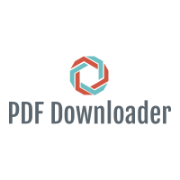

<p align="center">
  
</p>

<h1 align="center">PDF Downloader</h1>

<p align="center">
  <em>Point it at a page. Walk away. Come back to a folder full of PDFs.</em>
</p>

<p align="center">
  
  
  
</p>

---

Ever landed on a course page, a lecture-notes index, or a documentation hub that's
absolutely *littered* with PDF links — and realised you'd have to right-click →
"Save as" your way through all forty of them? Yeah. Me too. That's the whole reason
this exists.

**PDF Downloader** is a tiny command-line web scraper. You hand it a URL, it reads
the page, finds every link that resolves to a `.pdf`, and downloads the lot into a
folder of your choosing. No browser extensions, no clicking, no drama.

## Features

- **One command, many PDFs** — scrapes every `.pdf` link on a page in a single pass.
- **Smart link resolution** — relative links, nested paths, and `<base>` tags all
  resolve to correct absolute URLs. Query strings (`report.pdf?v=2`) are handled too.
- **No duplicates** — the same file linked five times is downloaded once.
- **`--dry-run` mode** — preview exactly what *would* be grabbed before committing.
- **Never clobbers** — if `notes.pdf` already exists, the next one becomes
  `notes (1).pdf`.
- **Streaming downloads** — big files stream to disk in chunks instead of eating
  your RAM.
- **Friendly failures** — one broken link won't stop the batch; you get a clear
  report of what worked and what didn't.
- **Scriptable** — pass the URL as an argument, or run it bare and get prompted.

## Requirements

- **Python 3.8 or newer** — check with `python3 --version`.
- A terminal. That's it.

## Install

Copy-paste, top to bottom. This clones the repo, creates an isolated virtual
environment (so nothing pollutes your system Python), and installs the three
dependencies.

```bash
# 1. Grab the code
git clone https://github.com/waleedsworld/PDFDownloader.git
cd PDFDownloader

# 2. Create and activate a virtual environment
python3 -m venv .venv
source .venv/bin/activate          # Windows: .venv\Scripts\activate

# 3. Install the dependencies
pip install -r requirements.txt
```

That's the whole setup. Grab a coffee — you were faster than the PDFs would've been.

## Usage

**Interactive** (it'll ask you for the link):

```bash
python3 src/PdfDownloader.py
```

**One-liner** (pass the URL directly):

```bash
python3 src/PdfDownloader.py https://example.edu/course/notes
```

**Pick where files land:**

```bash
python3 src/PdfDownloader.py https://example.edu/notes -o ./downloads
```

**Just look, don't touch** (see what it would grab):

```bash
python3 src/PdfDownloader.py https://example.edu/notes --dry-run
```

### All the options

| Flag                 | What it does                                              |
| -------------------- | -------------------------------------------------------- |
| `url`                | The page to scrape (optional — prompted if omitted).     |
| `-o`, `--output DIR` | Folder to save PDFs into. Default: current directory.    |
| `--dry-run`          | List the PDFs that would be downloaded, but don't fetch. |
| `--user-agent UA`    | Send a custom `User-Agent` header.                       |
| `-h`, `--help`       | Show the built-in help.                                  |

### What you'll see

```text
Found 3 PDF link(s):
  - https://example.edu/notes/week1.pdf
  - https://example.edu/notes/week2.pdf
  - https://example.edu/notes/week3.pdf

Downloading to: /home/you/downloads

  [1/3] ok  week1.pdf
  [2/3] ok  week2.pdf
  [3/3] ok  week3.pdf

Done! 3 downloaded, 0 failed.
```

## Running the tests

The link-parsing logic is covered by a small, network-free test suite:

```bash
pip install pytest
python3 -m pytest tests/ -q
```

## How it works (the 30-second version)

1. **Fetch** the page HTML with `requests` (sending a polite User-Agent).
2. **Parse** it with BeautifulSoup + lxml and walk every `<a href>`.
3. **Filter** to links whose path ends in `.pdf`, resolving each to an absolute
   URL against the page (or its `<base>` tag) and de-duplicating as it goes.
4. **Stream** each PDF to disk, picking a non-clobbering filename.

Four small, well-named functions — easy to read, easy to extend.

## Live demo

Live demo — deploying soon.

## A note on being a good web citizen

This tool fetches publicly linked files. Please only point it at pages you're
allowed to download from, respect each site's `robots.txt` and terms of service,
and don't hammer servers. Be nice out there.

## Contributing

Ideas and pull requests are genuinely welcome — especially handling for pages that
link PDFs behind `.html` redirect pages, or per-university quirks. Fork it, branch
it, send it over.

## License

Released under the MIT License. Do good things with it.
